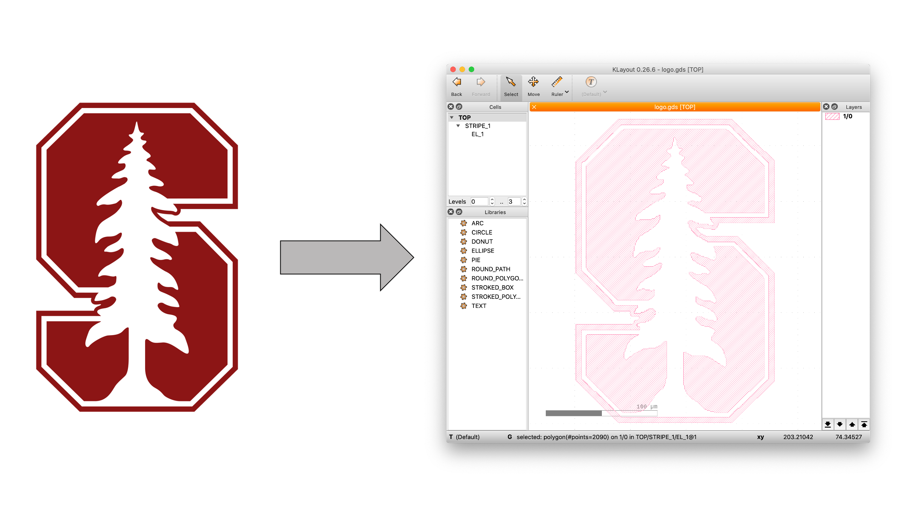

# metagds

This package provides a simple and versatile interface in Matlab environment for creating your own GDS files of your geomeries to be used, for example, in a nanofabrication process or for simulations.

Functions included make use of the Ulf Griesmann’s GDSII Toolbox (available from [here](https://sites.google.com/site/ulfgri/numerical/gdsii-toolbox)).

See manual.pdf for all the info and examples.

